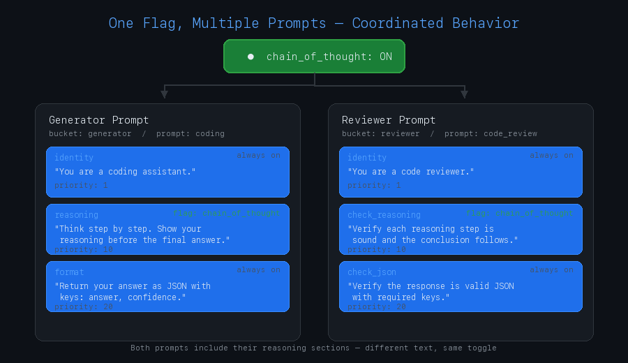

# prompt_flags

**Feature flags for prompt engineering** -- declarative section management, scoped overrides, and topological ordering for LLM prompts.

[](https://www.python.org/downloads/)
[](LICENSE)

## Why prompt_flags?

When you have multiple prompts that need to stay in sync -- a generator and a reviewer, a planner and an executor, a coder and a tester -- changing one means updating all the others. **prompt_flags** solves this with a single toggle that coordinates different text across different prompts simultaneously.

<p align="center">
  
</p>

One flag. Two prompts. Different text. Always in sync.

```yaml
flags:
  chain_of_thought:
    default: true

buckets:
  generator:
    prompts:
      coding:
        sections:
          - id: "reasoning"
            flag: "chain_of_thought"
            content: "Think step by step. Show your reasoning before the final answer."

  reviewer:
    prompts:
      code_review:
        sections:
          - id: "check_reasoning"
            flag: "chain_of_thought"
            content: "Verify each reasoning step is sound and the conclusion follows."
```

Flip `chain_of_thought` to `false` and both sections vanish. Flip it back and both return -- each with its own prompt-specific text. No manual coordination, no drift, no forgetting to update the reviewer when you change the generator.

This works across any number of prompts, any number of flags, with overrides at the global, bucket, prompt, or runtime level.

## What is this?

`prompt_flags` brings feature-flag discipline to prompt engineering. Define your prompts as composable sections, gate them behind feature flags with a 4-tier resolution hierarchy, and let topological sorting handle ordering. Ship prompt changes with the same confidence you ship code changes -- toggle sections on and off without rewriting templates, override behavior per-bucket or at runtime, and trace exactly which tier resolved each flag.

## Installation

```bash
pip install prompt_flags
```

Or with [uv](https://docs.astral.sh/uv/):

```bash
uv add prompt_flags
```

For plugin support (pluggy hooks):

```bash
pip install prompt_flags[plugins]
```

## Quick Start

Build a prompt with feature-flagged sections in under 10 lines:

```python
from prompt_flags import PromptBuilder

prompt = (
    PromptBuilder("assistant")
    .section("role", "You are a helpful coding assistant.", priority=1)
    .section("reasoning", "Think step by step before answering.", flag="cot", priority=10)
    .section("format", "Respond in JSON format.", flag="json_output", priority=20)
    .flag("cot", default=True)
    .flag("json_output", default=False)
    .render()
)

print(prompt)
# You are a helpful coding assistant.
#
# Think step by step before answering.
```

The `json_output` flag defaults to `False`, so that section is excluded. Enable it at runtime:

```python
prompt = (
    PromptBuilder("assistant")
    .section("role", "You are a helpful coding assistant.", priority=1)
    .section("reasoning", "Think step by step before answering.", flag="cot", priority=10)
    .section("format", "Respond in JSON format.", flag="json_output", priority=20)
    .flag("cot", default=True)
    .flag("json_output", default=False)
    .render(flags={"json_output": True})
)

print(prompt)
# You are a helpful coding assistant.
#
# Think step by step before answering.
#
# Respond in JSON format.
```

## YAML-Driven Configuration

For teams that prefer configuration over code, define everything in YAML:

```yaml
# promptflags.yaml
version: "1.0"

buckets:
  system:
    description: "System prompts"
    prompts:
      assistant:
        sections:
          - id: "identity"
            content: "You are a helpful assistant."
            priority: 1
          - id: "reasoning"
            content: "Think step by step."
            flag: "cot"
            priority: 10
          - id: "safety"
            content: "Do not generate harmful content."
            flag: "safety"
            priority: 30

flags:
  cot:
    default: true
    description: "Chain of thought reasoning"
  safety:
    default: true
    description: "Safety guardrails"
```

Load and render:

```python
from prompt_flags import from_yaml, render_prompt

registry = from_yaml("promptflags.yaml")

# Render with all defaults
result = render_prompt(registry, "system", "assistant")
print(result)
# You are a helpful assistant.
#
# Think step by step.
#
# Do not generate harmful content.

# Disable chain-of-thought at runtime
result = render_prompt(registry, "system", "assistant", flags={"cot": False})
print(result)
# You are a helpful assistant.
#
# Do not generate harmful content.
```

<details>
<summary><strong>Full YAML reference</strong></summary>

The YAML schema supports nested bucket and prompt-level flag overrides, section ordering constraints, environment variable mappings, and template references:

```yaml
version: "1.0"

buckets:
  guides:
    description: "Step-by-step reasoning guides"
    template_dir: "prompts/guides"
    enabled: true
    flags:
      chain_of_thought:
        enabled: true       # Bucket-level override
      few_shot_examples:
        enabled: true
    ordering:
      - before: "reasoning_steps"
        after: "worked_example"
    prompts:
      coding_guide:
        template: "coding_guide.j2"
        sections:
          - id: "reasoning_steps"
            flag: "chain_of_thought"
            priority: 10
          - id: "worked_example"
            flag: "few_shot_examples"
            priority: 20
          - id: "style_constraints"
            flag: "safety_guardrails"
            priority: 30
      analysis_guide:
        template: "analysis_guide.j2"
        flags:
          verbose_instructions:
            enabled: false   # Prompt-level override
        sections:
          - id: "analysis_framework"
            flag: "chain_of_thought"
            priority: 10
          - id: "output_schema"
            flag: "json_output"
            priority: 20

flags:
  chain_of_thought:
    default: true
    description: "Enable step-by-step reasoning sections"
  few_shot_examples:
    default: false
    description: "Include few-shot examples in prompts"
  json_output:
    default: false
    description: "Instruct model to respond in JSON"
  safety_guardrails:
    default: true
    description: "Include safety constraint sections"
  verbose_instructions:
    default: false
    description: "Use detailed instruction variants"

ordering:
  - before: "system_identity"
    after: "task_description"
  - before: "task_description"
    after: "constraints_block"

env_vars:
  MODEL_NAME:
    default: "gpt-4"
  TEMPERATURE:
    default: "0.7"
    type: "float"
```

All YAML models use `extra="forbid"` validation, so typos in field names are caught at load time. Cross-references (section flag names pointing to declared flags) are validated automatically.

</details>

## Feature Flags

Flags resolve through a 4-tier precedence chain, from highest to lowest priority:

| Tier | Source | Example |
|------|--------|---------|
| 0 | **Runtime override** | `render(flags={"cot": False})` |
| 1 | **Prompt-level override** | YAML `prompts.analysis_guide.flags.verbose: false` |
| 2 | **Bucket-level override** | YAML `buckets.guides.flags.cot: true` |
| 3 | **Global default** | YAML `flags.cot.default: true` |

A value of `None` at any tier means "not set here, defer to parent." The resolver walks up the chain until it finds an explicit value.

### Inspecting flag resolution

Every resolved flag carries a `FlagResult` with provenance information:

```python
from prompt_flags import PromptBuilder

registry = (
    PromptBuilder("assistant")
    .in_bucket("guides")
    .section("reasoning", "Think step by step.", flag="cot", priority=10)
    .flag("cot", default=False)
    .bucket_flag_override("cot", True)
    .build()
)

flag_map = registry.resolve_flags("guides", "assistant")
result = flag_map["cot"]

print(f"{result.name}={result.value} (source: {result.source})")
# cot=True (source: bucket)
```

The `source` field tells you exactly which tier provided the value: `"global"`, `"bucket"`, `"prompt"`, or `"runtime"`.

## Section Ordering

Sections are ordered using a combination of **priority values** and **topological constraints**. Priority sets the default order (lower = earlier). Constraints (`before`/`after`) add hard ordering edges that override priority.

```python
from prompt_flags import PromptBuilder

result = (
    PromptBuilder("test")
    .section("output", "Format your response as JSON.", priority=100)
    .section("identity", "You are a coding assistant.", priority=100)
    .section("reasoning", "Think step by step.", priority=100)
    .order("identity", after="reasoning")    # identity comes before reasoning
    .order("reasoning", after="output")      # reasoning comes before output
    .render()
)

print(result)
# You are a coding assistant.
#
# Think step by step.
#
# Format your response as JSON.
```

All three sections have the same priority (100), but the `order()` constraints enforce `identity -> reasoning -> output`. Within a topological level, ties are broken by priority (lower first).

Sections can also declare their own constraints inline:

```python
.section("format", "Respond in JSON.", flag="json", priority=20, after=["reasoning"])
```

Cyclic constraints raise an `OrderingCycleError` with details about which sections are involved.

## Four Ways to Build Prompts

### Fluent Builder

The `PromptBuilder` provides a chainable API for constructing prompts:

```python
from prompt_flags import PromptBuilder

result = (
    PromptBuilder("coding_guide")
    .in_bucket("guides")
    .section("identity", "You are a {{ role }}.", priority=1)
    .section("reasoning", "Think step by step.", flag="cot", priority=10)
    .section("format", "Respond in {{ fmt }}.", flag="json", priority=20, after=["reasoning"])
    .flag("cot", default=True)
    .flag("json", default=False)
    .order("identity", after="reasoning")
    .render(context={"role": "coding assistant", "fmt": "JSON"}, flags={"json": True})
)

print(result)
# You are a coding assistant.
#
# Think step by step.
#
# Respond in JSON.
```

Call `.build()` to get a `PromptRegistry` for more control, or `.render()` to build and render in one step.

### Decorator API

Define prompts as classes with decorated methods:

```python
from prompt_flags import bucket, prompt, section
from prompt_flags.api.decorators import get_global_registry
from prompt_flags.api.functional import render_prompt
from prompt_flags.core.models import Flag

@bucket("guides")
@prompt("coding_guide")
class CodingGuide:
    @section(id="identity", priority=1)
    def identity(self, ctx):
        return "You are a coding assistant."

    @section(id="reasoning", flag="cot", priority=10)
    def reasoning(self, ctx):
        return "Think step by step before answering."

# Instantiation triggers registration with the global registry
guide = CodingGuide()

registry = get_global_registry()
registry.add_flag(Flag(name="cot", default=True))

result = render_prompt(registry, "guides", "coding_guide")
print(result)
# You are a coding assistant.
#
# Think step by step before answering.
```

Multiple decorated classes register into the same global registry. Classes in different buckets coexist naturally.

### Functional API

For simple cases, use standalone functions:

```python
from prompt_flags import from_yaml, render_prompt, compose

registry = from_yaml("promptflags.yaml")

# Render a single prompt
result = render_prompt(registry, "system", "assistant", context={"name": "Alice"})

# Compose across multiple buckets
full_prompt = compose(
    registry,
    ["system_context", "guides", "constraints"],
    context={"name": "Alice"},
    flags={"verbose": True},
)
```

`compose()` renders all prompts in each bucket and joins them with double newlines, processing buckets in the order you specify.

### YAML + Code Together

YAML-defined and code-defined prompts coexist in the same registry. Load your YAML config, then add code-defined sections on top:

```python
from prompt_flags import from_yaml
from prompt_flags.core.models import Bucket, Flag, Prompt, Section

registry = from_yaml("promptflags.yaml")

# Add a code-defined prompt to an existing bucket
dynamic_section = Section(id="dynamic", content="Today's special instructions.", priority=5)
dynamic_prompt = Prompt(name="dynamic_prompt", sections=[dynamic_section])

registry.add_bucket(Bucket(
    name="extras",
    prompts={"dynamic_prompt": dynamic_prompt},
))
```

## Jinja2 Templates

Section content is rendered through Jinja2 with feature-flag-aware globals. There are three ways to use feature flags in templates:

### Tier 1: `feature_enabled()` function

The simplest approach -- a global function available in every template:

```python
from prompt_flags import PromptBuilder

result = (
    PromptBuilder("test")
    .section("main", """You are a helpful assistant.

Here are detailed instructions for every scenario.

Always be concise.""")
    .flag("verbose", default=False)
    .render(flags={"verbose": True})
)

print(result)
# You are a helpful assistant.
# Here are detailed instructions for every scenario.
# Always be concise.
```

### Tier 2: `env()` function

Access environment variables with defaults:

```jinja2
You are a {{ env("ASSISTANT_ROLE", "helpful assistant") }}.
The model is {{ env("MODEL_NAME", "gpt-4") }}.
```

### Tier 3: `` extension tag (opt-in)

For power users, the `FeatureFlagExtension` provides a dedicated block tag:

```python
from prompt_flags.rendering.engine import PromptRenderer
from prompt_flags.rendering.extensions import FeatureFlagExtension

renderer = PromptRenderer(extensions=[FeatureFlagExtension])
```

```jinja2

Think step by step before answering.

```

When the flag is disabled, the entire block produces no output.

<details>
<summary><strong>Template filters</strong></summary>

Two custom Jinja2 filters are available:

- `strip_empty_lines` -- removes all empty lines from text
- `indent_block` -- indents non-empty lines by a given number of spaces (default: 2)

The rendering engine also normalizes whitespace automatically, collapsing multiple consecutive blank lines into a single blank line.

</details>

## Plugin System

`prompt_flags` defines four Protocol interfaces for zero-coupling integration with external systems:

| Protocol | Purpose |
|----------|---------|
| `PromptLoader` | Load templates from any backend (filesystem, S3, database) |
| `PromptRenderer` | Render templates with any engine (Jinja2, Mustache, etc.) |
| `PromptComposer` | Assemble sections into final output (join, format, etc.) |
| `FlagSource` | Fetch flags from external systems (LaunchDarkly, Unleash, etc.) |

Protocols use structural typing -- implement the matching methods and it works, no inheritance required:

```python
from prompt_flags.plugins.protocols import FlagSource

class MyFlagSource:
    """Fetch flags from my custom system."""

    def get_flag(self, name: str, context: dict) -> bool | None:
        return my_flag_store.get(name)

    def get_all_flags(self, context: dict) -> dict[str, bool]:
        return my_flag_store.get_all()

# This satisfies the FlagSource protocol -- no imports needed
assert isinstance(MyFlagSource(), FlagSource)
```

<details>
<summary><strong>Pluggy hooks (requires <code>prompt_flags[plugins]</code>)</strong></summary>

The plugin system also provides lifecycle hooks via [pluggy](https://pluggy.readthedocs.io/):

| Hook | When | Can modify |
|------|------|-----------|
| `pre_load` | Before template loading | Template name |
| `post_load` | After loading raw content | Raw content |
| `pre_render` | Before Jinja2 rendering | Template + context |
| `post_render` | After rendering | Rendered text |
| `on_flag_resolved` | After each flag resolution | Nothing (observability) |

Example plugin:

```python
from prompt_flags.plugins.hookspecs import hookimpl

class TokenCounterPlugin:
    @hookimpl
    def post_render(self, rendered_text: str, metadata: dict) -> str:
        token_count = len(rendered_text.split())
        print(f"Approximate tokens: {token_count}")
        return rendered_text
```

Register plugins programmatically or via entry points in `pyproject.toml`:

```toml
[project.entry-points."prompt_flags.plugins"]
my_plugin = "my_package:MyPlugin"
```

</details>

## API Reference

All public exports from `prompt_flags`:

| Export | Type | Description |
|--------|------|-------------|
| `PromptBuilder` | Class | Fluent builder for constructing prompts |
| `PromptRegistry` | Class | Central coordinator for buckets, flags, and constraints |
| `PromptRenderer` | Class | Jinja2-based rendering engine |
| `Bucket` | Model | Named category of related prompts |
| `Section` | Model | Atomic block of prompt text |
| `Flag` | Model | Feature flag definition with default value |
| `FlagOverrides` | Model | 3-tier override chain for a flag |
| `FlagResult` | Model | Resolved flag value with provenance |
| `OrderingConstraint` | Model | Relative ordering between two sections |
| `RenderedSection` | Model | Section after rendering |
| `UndefinedFlagError` | Exception | Raised for undefined flag references |
| `OrderingCycleError` | Exception | Raised for cyclic ordering constraints |
| `from_yaml()` | Function | Load YAML config into a `PromptRegistry` |
| `render_prompt()` | Function | Render a single prompt with resolved flags |
| `compose()` | Function | Compose prompts across multiple buckets |
| `bucket` | Decorator | Register a class in a named bucket |
| `prompt` | Decorator | Register a class as a prompt |
| `section` | Decorator | Register a method as a section provider |
| `PromptLoader` | Protocol | Interface for template loading backends |
| `PromptRendererProtocol` | Protocol | Interface for template rendering engines |
| `PromptComposer` | Protocol | Interface for section composition |
| `FlagSource` | Protocol | Interface for external flag providers |

## Development

### Setup

```bash
git clone https://github.com/zacharysbrown/prompt-flags.git
cd prompt-flags
uv sync --all-extras
```

### Run tests

```bash
uv run pytest                    # All tests
uv run pytest tests/unit/        # Unit tests only
uv run pytest tests/integration/ # Integration tests only
```

### Linting and type checking

```bash
uv run ruff check .              # Lint
uv run ruff format --check .     # Format check
uv run pyright                   # Type check
```

### Project structure

```
src/prompt_flags/
  api/          # Builder, decorators, functional API
  config/       # YAML schema, loader, defaults
  core/         # Domain models, registry, resolver, ordering
  rendering/    # Jinja2 engine, extensions, filters
  plugins/      # Protocol interfaces, hookspecs, manager
```

## License

MIT
